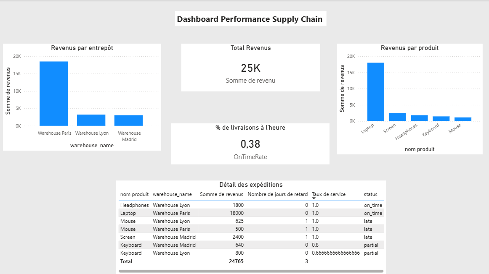

Supply Chain KPI Pipeline – Data Engineering Project

 Description

Ce projet consiste à construire un pipeline de données complet dans le domaine de la supply chain afin d’analyser la performance logistique à travers plusieurs KPI métier.

L’objectif est de simuler un cas réel de Data Engineering en intégrant toutes les étapes :
ingestion, transformation, stockage, analyse et orchestration.

 Objectifs du projet

- Construire un pipeline ETL complet
- Manipuler des données supply chain (produits, entrepôts, livraisons)
- Calculer des KPI métier :
  - Revenue
  - Fill rate
  - Delivery delay
- Stocker les données dans une base SQL
- Orchestrer le pipeline avec Airflow
- Visualiser les résultats avec Power BI

 Stack technique

- Python (Pandas)
- SQL (SQLite)
- Docker
- Apache Airflow
- Power BI

 Structure du projet

'''supply_chain_kpi_pipeline/
│
├── app/
│ ├── data/ # fichiers CSV (sources)
│ ├── extract.py
│ ├── transform.py
│ ├── load.py
│ ├── analyze.py
│ ├── pipeline.py
│ └── output/ # fichiers générés (CSV + DB)
│
├── dags/
│ └── supply_chain_dag.py
│
├── docker-compose.yml
├── Dockerfile
├── requirements.txt
└── README.md '''

 Pipeline ETL

 1. Extract
Chargement des données depuis plusieurs sources CSV :
- suppliers
- products
- warehouses
- inventory
- shipments

2. Transform
- Jointure des différentes tables
- Calcul des KPI :
  - revenue = quantity_delivered × unit_price
  - fill_rate = quantity_delivered / quantity_shipped
  - delay = actual_delivery_date - expected_delivery_date

3. Load
- Export en CSV
- Chargement dans SQLite :
  - table : `supply_chain_final`

 Analyse des données (SQL)

Requêtes permettant de calculer :

- Revenue par produit  
- Revenue par entrepôt  
- Fill rate moyen  

 Orchestration

Le pipeline est orchestré avec **Apache Airflow** dans un environnement **Dockerisé** :

- Déclenchement automatique du pipeline
- Exécution via un DAG Airflow
- Monitoring des runs

 Dashboard Power BI

Visualisation des KPI :
- Revenue par produit
- Performance des entrepôts
- Fill rate
- Analyse des retards logistiques

 Lancer le projet

 1. Lancer Airflow avec Docker

bash
docker compose up
2. Accéder à Airflow

http://localhost:8080

Login :

username : admin

password : admin

3. Lancer le DAG

Activer le DAG

Cliquer sur "Trigger"

 Résultats

Ce pipeline permet de :

Suivre la performance supply chain

Identifier les produits les plus rentables

Analyser les retards de livraison

Optimiser le taux de service

 Améliorations possibles :

Intégration d’un Data Warehouse (Snowflake / BigQuery)

Ingestion via API

Déploiement cloud (AWS / GCP)

Monitoring avancé

 Insights clés
- Analyse des revenus par entrepôt
- Suivi du taux de livraison à l’heure
- Identification des axes d’amélioration logistique

 Dashboard

Kevin Ntary Calaffard

